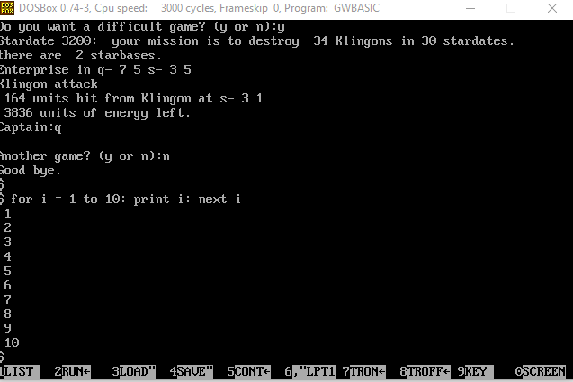

# TinyBasic
Interpreters for Tiny Basic written in GWBasic, C, C#, VB.Net, Python, Pascal, and others. Pure interpreters, e.g., not byte code, not even pre-tokenized.

For instance, gw.bas is an interpreter for Tiny Basic written in GWBasic.

It supports:
- bye/quit, clear, cls, end/stop, help, list, load, new, run, tron, troff
- for <var> = <expr1> to <expr2> ... next <var>
- gosub <expr> ... return
- goto <expr>
- if <expr> then <statement>
- input [prompt,] <var>
- [let] <var>=<expr>
- print <expr|string>[,<expr|string>][;]
- rem <anystring> or '<anystring>
- Operators: + - * / < <= > >= <> =
- Integer variables a..z, and single integer array: @(expr)
- Functions: abs(expr), asc(ch), rnd(expr), sgn(expr)
- ":" to have multiple statements per line.
- Line numbers are required for programs, but has an interactive mode too.

Has enough features that it can run a Tiny Basic version of Star Trek.
Tested in DosBox, running GWBASIC version 3.23.

[samples/strek-tb.bas is a version of the Star Trek game, that gw can run.](samples/strek-tb.bas)

This was tested via [DoxBox](https://www.dosbox.com), running GW-Basic version 3.23.

If you just enter a statement without a line number, it is run interactively:

